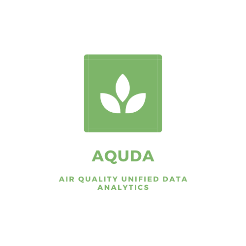
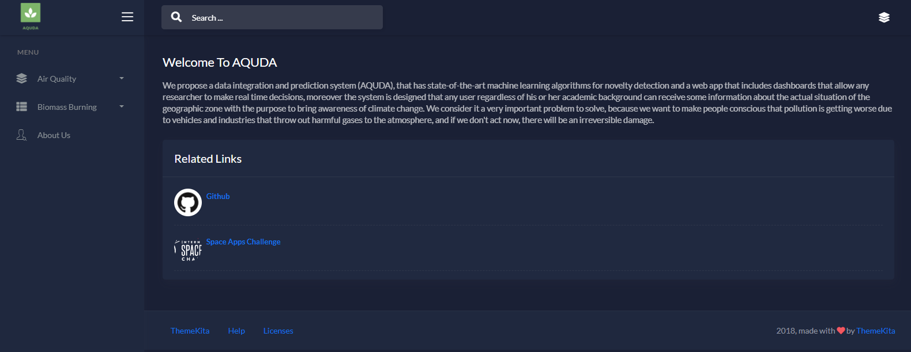
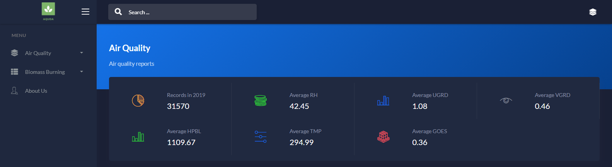
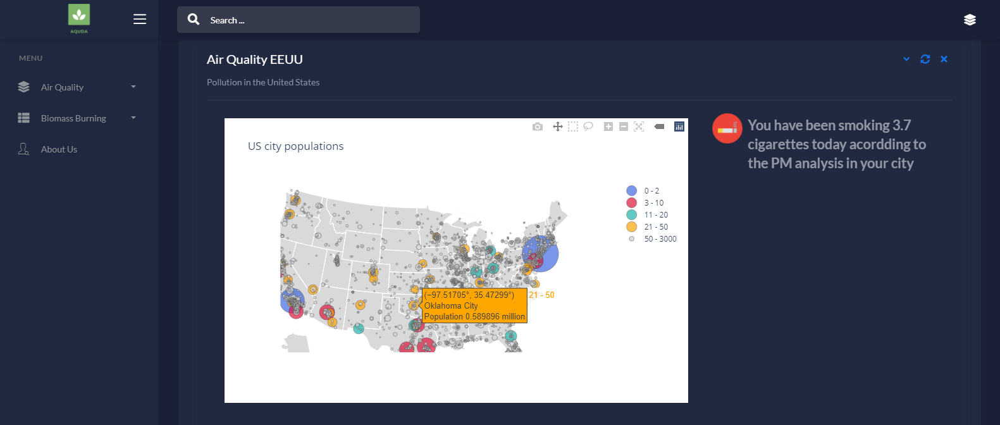
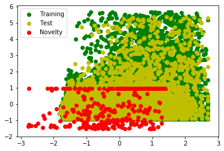
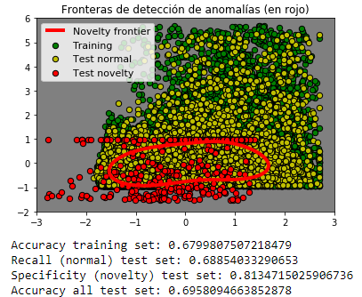

# AQUDA

  

We propose a data integration and prediction system (AQUDA), that has state-of-the-art machine learning algorithms for novelty detection and a web app that includes dashboards that allow any researcher to make real time decisions, moreover the system is designed that any user regardless of his or her academic background can receive some information about the actual situation of the geographic zone with the purpose to bring awareness of climate change. We consider it a very important problem to solve, because we want to make people conscious that pollution is getting worse due to vehicles and industries that throw out harmful gases to the atmosphere, and if we don't act now, there will be an irreversible damage.

    
    
    

## Space Apps Challenge - AQUDA Solution

AQUA was born from the hackathon space apps 2020. You can find more information [HERE](https://2020.spaceappschallenge.org/challenges/inform/automated-detection-hazards/teams/mlonfire/project).

## Requirements

- Languages:
  
 

- Libraries: scikit-learn, numpy, matplotlib, dash, torchvision, PIL, Django, bootstrap, pytorch, pandas, seaborn.

## Dashboard

We build a dashboard for the visualization of data on air quality.

Visualization of statistics for the metrics of PM, RH, UGRD, VGRD, HPBL, TMP, GOES per year.

Visualization of the behavior of the measures with respect to the others

Visualization of the averages of the different measurements per month.

We raise awareness for all people. It consists of knowing how many cigarettes smoked per day the air you breathe is equivalent.

## [System for the detection of harmful particles in the air](https://github.com/KorKux1/Automated-Detection-of-Hazards/blob/develop/Notebooks/AQUDA-Novelty%20detection.ipynb)

We created a system based on the detection of anomalies to be able to identify data of harmful particles and make predictions of future records.

## [System for the detection of dust particles given satellite images](https://github.com/KorKux1/Automated-Detection-of-Hazards/blob/develop/Notebooks/Nasa_Analytics.ipynb)

We developed a deep neural network based on ResNet-50 to perform dust detection in the air by satellite images.

## Installation

**Clone the repository**

    $ git clone https://github.com/KorKux1/Automated-Detection-of-Hazards.git

**Create virtual enviroment:**

    $ python -m venv env

Active your enviroment

**Install dependencies**

    $ pip install -r requirements.txt

**Run the project**

    $ python manage.py runserver

## Contributors

- Christian Urcuqui.
- Cristhian Eduardo Castillo.
- Jhoan Delgado.

## License

AGPL-3.0

---
⌨️ with the ❤️
